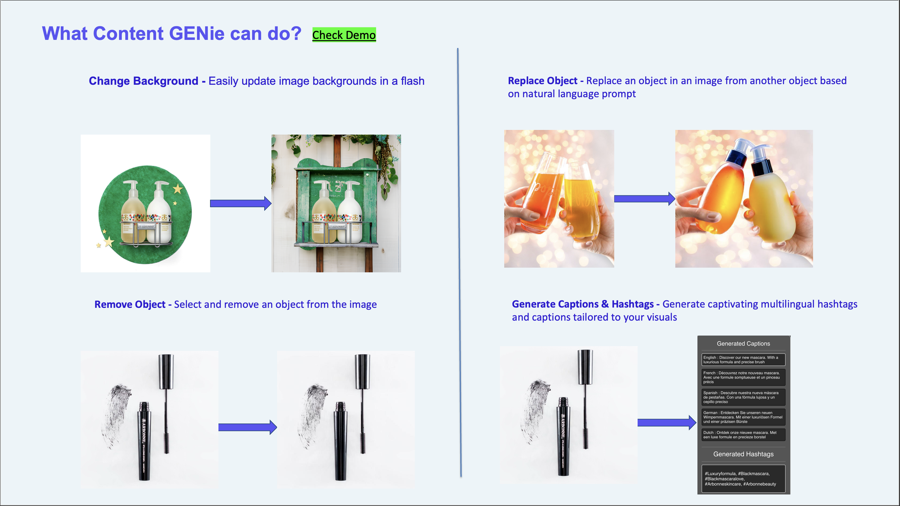
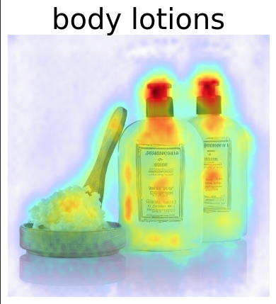
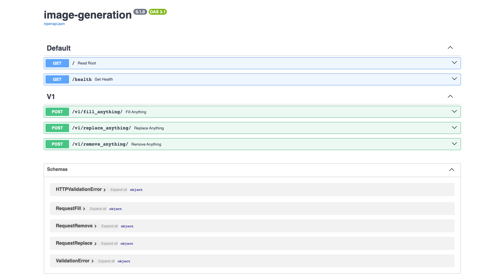

# Social Media Content Creator - Content Genie
An AI based Image Editing and multilingual social media caption and hashtag generator

## Content Genie Demo Video 
https://github.com/shreyassks/Image-Editing/assets/44189581/82c78d52-a02e-437d-b0ed-1034d1b83635

### Google Slides Presentation
https://docs.google.com/presentation/d/1pbDHA7DIuM8BArwQZqm8eD-PZJRn28eg/edit?usp=drive_link&ouid=113737295631185544437&rtpof=true&sd=true

### Product Features in Content Genie


### Model Interpretability using Diffusion Attentive Attribution Maps (DAAM)


## Description
In today's competitive business landscape, engaging customers through effective marketing content, especially on digital channels, is crucial for driving business goals and building brand loyalty. However, many customers often struggle to create compelling marketing materials that resonate with their target audience. They may lack the resources, skills, and time to produce high-quality content consistently. It is frequently observed that Social Media  Managers usually work with agencies that create the content for them. Any tweak in the content requires to and fro between the marketing managers and the agencies, which is not cost effective both in terms of money and time. There could be time-sensitive campaigns that would require the Social Media Managers to modify the content immediately.

The challenge for this hackathon is to develop a platform or solution that empowers customers with real-time, AI-powered image editing capabilities allowing them to customize and enhance the generated images on-the-fly, with options to remove, replace or refill specific objects using intuitive text prompts. The platform would also employ a style-based caption generation model, automatically producing contextually relevant and stylized captions that resonate with the visuals. The solution would be user-friendly, scalable, and accessible to businesses, regardless of their technical expertise.


## Features
Edits images and recommends suitable social media captions and hashtags
1. Removes any object in the image
2. Fills the masked object corresponding to the text prompt 
3. Replaces the background corresponding to the text prompt
4. Recommends Captions and Hashtags suitable for the selected image


## Installation
To install this service there are 2 ways. Often, running the service locally allows you to easily change and test the code. If you're ready for productizing, run the service as containerize service.

### Run service locally
Install virtual environment

Step 1 :- Creates a Virtual Environment named "venv"
```commandline
python3.10 -m venv venv
```
Step 2 :- Activate the Virtual environment
```commandline
source venv/bin/activate
```
Step 3 :- Install required packages 
```commandline
pip install -r requirements.txt
```
Step 4 :- Enable sso - Go to home directory and run below command
```commandline
aws sso login --profile sso_profile
```
Step 5 :- Allow SSO on browser
``` 
Select Open
Check that the code is auto filled then Click Next 
Click Allow
```
Step 6:- Run the below command from app folder
```commandline
uvicorn main:app --host 0.0.0.0 --reload
```
Step 7:- Now you can use the integrated docs at:
```commandline
http://127.0.0.1:8000/docs
```


## Directory Structure of Backend Services

